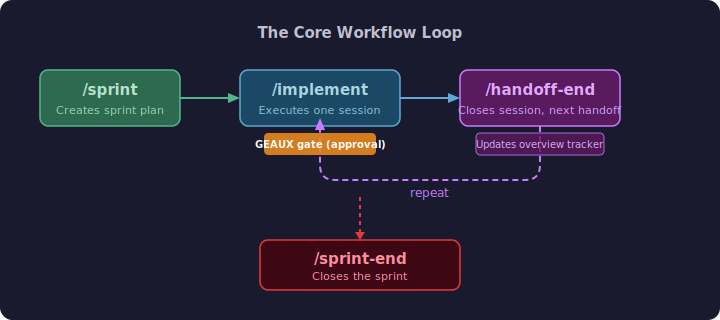
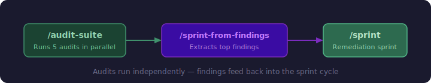

# Claude Code Commands

**A project management workflow for AI-assisted development.**

You don't need to know how to code. You need to know how to manage work.

<p align="center">
  
  <br />
  <em>Scan to visit this repo</em>
</p>

---

## The Core Insight

> **You are the project manager. Claude is the workforce.**

This repo contains a complete workflow — 44 slash commands for [Claude Code](https://docs.anthropic.com/en/docs/claude-code) — that applies proven project management principles to AI-assisted development. Sprint planning, scoped handoffs, approval gates, parallel workstreams, and persistent project memory.

Coding knowledge matters less than the discipline to structure the work properly. Claude can write the code. It cannot manage itself.

Built over 50+ sprints on a real production codebase (multi-language, 150k+ lines), then extracted and generalized for any project. The person who built it did not write a single line of code.

For the thinking behind this workflow, see [METHODOLOGY.md](METHODOLOGY.md).

---

## Table of Contents

- [Quick Start](#quick-start)
- [The Methodology](#the-methodology)
- [Why This Works](#why-this-works)
- [The Workflow](#the-workflow)
- [Skill Catalog](#skill-catalog)
- [Audit Suite](#audit-suite)
- [Configuration](#configuration)
- [Memory Protocol](#memory-protocol)
- [Examples](#examples)
- [License](#license)

---

## Quick Start

```bash
# 1. Clone this repo
git clone https://github.com/BioMycoBit/claude-code-commands.git

# 2. Copy commands into your project
cp -r claude-code-commands/.claude/commands/ your-project/.claude/commands/

# 3. Copy semgrep rules (used by audit commands)
cp -r claude-code-commands/.semgrep/ your-project/.semgrep/

# 4. Start Claude Code in your project
cd your-project
claude

# 5. Type a slash command
/sprint my first feature
```

Claude Code auto-discovers commands in `.claude/commands/`. No configuration needed to start — just copy the files.

---

## The Methodology

This is classical project management applied to AI coding:

### 1. Plan — Sprint First
Before doing anything, create a plan. Analyze the codebase, define the goal, break it into numbered sessions. A sprint answers: *What are we building and in what order?*

### 2. Scope — Handoffs Define the Work
Break the sprint into self-contained components. Each handoff defines exactly what files will be touched, what success looks like, and **when to stop**. This is where scope creep is eliminated — by design, before implementation begins.

### 3. Approve — GO/NO-GO Gate
Before any code is written, an approval gate requires you to read and agree to the scope. That single moment of friction prevents most downstream chaos.

### 4. Execute — Claude Implements
Claude follows the scoped handoff. Linters run. A slop check catches AI anti-patterns. Changes stay contained.

### 5. Document — Close the Session
The session closes, the sprint tracker updates, the next handoff is created, and the work is committed. The context is clean and the next session has a clear starting point.

### 6. Repeat

---

## Why This Works

### Handoffs Eliminate Scope Creep

Claude is very willing to go wherever you point it — which is a feature that becomes a bug without structure. Without a handoff, sessions sprawl: half-finished features, unintended changes, no clear definition of done.

The handoff makes every session **surgical rather than exploratory**. You go in, do the specific thing, come out.

> **Beginners let Claude roam. The handoff approach makes every session surgical.**

### Context Engineering — Solved Proactively

Most people react to context problems: compacting, summarizing, trying to rescue a bloated session mid-flight. Compaction is lossy — you're working with Claude's compressed interpretation of what mattered.

The sprint/handoff structure solves this proactively. Each session starts **clean, focused, with exactly the right context** — the specific files, the specific goal, nothing else. Fresh context at the beginning of a scoped session is higher quality than compacted context late in a long one.

### Parallel Sessions — Never Waiting

Running 4 sessions simultaneously means you're never idle:

- **Session 1** — Active feature work
- **Session 2** — Audit (security, tech debt, etc.)
- **Session 3** — Code cleanup / refactoring
- **Session 4** — Exploration or next sprint planning

This mirrors how a project manager with multiple teams operates — orchestrating across workstreams simultaneously, never blocked by a single dependency. Tech debt and security reviews — always deprioritized in traditional workflows — run in the background alongside feature work.

### Traditional AI Coding vs This Workflow

| Traditional AI Coding | This Workflow |
|---|---|
| Ad-hoc prompting | Structured sprint planning |
| Sessions sprawl | Scoped handoffs with stop conditions |
| Wait on Claude | 4 parallel sessions, always reviewing |
| Context degrades | Fresh context by design each session |
| Tech debt accumulates | Background sessions run in parallel |
| Reactive context management | Proactive context engineering |
| Claude roams | Claude executes, you manage |

---

## The Workflow

The core workflow is a loop of four commands:

<p align="center">
  
</p>

### How It Works

1. **`/sprint [topic]`** — Analyzes your codebase and generates a sprint plan with numbered sessions (handoff documents). Each session has a clear goal, blast radius, success criteria, and stop conditions.

2. **`/implement @work/path/to/handoff.md`** — Loads the handoff document, researches the blast radius files, presents a GO/NO-GO gate for your approval, then executes the implementation. Runs linters and a slop check (AI anti-pattern detector) before finishing.

3. **`/handoff-end`** — Closes the current session, updates the sprint overview's progress tracker, creates the next handoff document, and commits.

4. **`/sprint-end`** — Closes the entire sprint with a retrospective: what went well, what didn't, velocity metrics.

### Supporting Commands

| Command | When to Use |
|---------|-------------|
| `/sidequest` | Handle an interruption without losing context on main work |
| `/park` | Pause a session that's blocked — saves state for later |
| `/amplify 4 doc.md` | Refine any document through 4 progressive passes |
| `/debug-bt` | Generate test scripts to verify your implementation works |
| `/slop-check` | Detect AI-generated fluff: placeholders, unnecessary abstractions, scope creep |

### The Audit Loop

Audits run independently from the sprint cycle. When findings accumulate:

<p align="center">
  
</p>

---

## Skill Catalog

### Workflow Commands (12)

| Command | Purpose |
|---------|---------|
| `/sprint` | Generate a sprint plan with architectural analysis, progress tracker, and first handoff |
| `/implement` | Execute a handoff document with approval gate, lint, slop check, and test generation |
| `/handoff-end` | Close a session, update the overview tracker, create next handoff, commit |
| `/sprint-end` | Close a sprint with retrospective insights and archive |
| `/amplify` | Iterative document refinement through 4 progressive passes |
| `/sidequest` | Branch a sub-task from a parked session with hierarchical numbering |
| `/park` | Temporarily set aside a blocked session with return context |
| `/debug-bt` | Generate test scripts for verifying implementations |
| `/slop-check` | Scan changed files for AI anti-patterns that linters miss |
| `/random-sprint` | Collect ad-hoc items interactively, then delegate to `/sprint` |
| `/pick-findings` | Circle back to audit findings that were initially skipped |
| `/sprint-from-findings` | Scan audit documents and build a remediation sprint from top findings |

### Audit Commands (27)

| Command | What It Checks |
|---------|---------------|
| `/audit-suite` | **Orchestrator** — runs all audits in a tier as parallel agents |
| `/audit-security` | SQL injection, XSS, command injection, secrets, TLS, debug mode |
| `/audit-secrets` | Git history scanning, .env hygiene, hardcoded credentials |
| `/audit-dependency` | Version pinning, major version gaps, outdated packages (Python/NPM/Rust) |
| `/audit-standards` | Linting trends, naming conventions, type annotations, exception handling |
| `/audit-test-quality` | Test inventory, flaky indicators, mock hygiene, coverage gaps |
| `/audit-python` | Cyclomatic complexity, maintainability, dead code, hotspot correlation |
| `/audit-typescript` | Circular dependencies, dead code, type duplication, component health |
| `/audit-rust` | Clippy pedantic, unwrap audit, dead code, unused PyO3 bindings |
| `/audit-codesweep` | Copy/paste duplication detection via jscpd |
| `/audit-resilience` | Error swallowing, missing timeouts, retry gaps, resource cleanup |
| `/audit-deadcode` | Unused exports, orphan files, uncalled functions |
| `/audit-regression` | Danger zone mapping, swallowed errors, test gaps for high-churn files |
| `/audit-performance` | Hot paths, N+1 queries, sequential awaits, unbounded growth |
| `/audit-docker` | Base image security, container privileges, resource limits, Trivy scanning |
| `/audit-observability` | Structured logging, correlation IDs, alert coverage, PII in logs |
| `/audit-pipeline` | Latency budgets, sample rates, buffer management, backpressure |
| `/audit-privacy` | GDPR/PII lifecycle, data retention, consent tracking, cookie usage |
| `/audit-modules` | Module boundaries, dependency enforcement (tach/knip) |
| `/audit-types` | Python type coverage (ty/pyright), TypeScript strict checking (tsc) |
| `/audit-iac` | Infrastructure config validation (Caddy, Prometheus, Grafana, docker-compose) |
| `/audit-database` | Schema consistency, query safety, connection patterns, migration safety |
| `/audit-sbom` | SBOM generation (CycloneDX/SPDX), vulnerability scanning via grype |
| `/audit-licenses` | GPL/AGPL/copyleft detection across Python, NPM, and Rust dependencies |
| `/audit-accessibility` | WCAG 2.1 AA: alt text, ARIA, keyboard handlers, focus styles, axe-core |
| `/audit-browser-compat` | CSS prefixes, modern JS APIs, polyfill checks (Chrome 90+, Firefox 88+, Safari 14+) |
| `/audit-api-surface` | Endpoint-to-frontend tracing, orphan endpoints, WebSocket message flow mapping |

### On-Demand Audits (4, not in tiers)

| Command | Purpose |
|---------|---------|
| `/audit-dashboard` | Unified health dashboard — reads all recent audits, computes composite scores |
| `/audit-project-overview` | Project pulse check — version status, recent work, sprint priorities |
| `/audit-system-walkthrough` | End-to-end data flow tracing through all system layers |
| `/audit-techdebt` | TODO/FIXME markers, type-safety gaps, large files, backward-compat code |

---

## Audit Suite

The 26 tiered audits are organized by priority:

| Tier | Frequency | Audits | Focus |
|------|-----------|--------|-------|
| **Tier 1** | Every sprint | security, dependency, secrets, standards, test-quality | Critical safety |
| **Tier 2** | Biweekly | python, typescript, rust, codesweep, resilience, deadcode, regression, performance | Code quality |
| **Tier 3** | Monthly | docker, observability, pipeline, privacy, modules, types, iac, database | Infrastructure |
| **Tier 4** | Quarterly | sbom, licenses, accessibility, browser-compat, api-surface | Compliance |

### Running Audits

```bash
# Run a single audit
/audit-security

# Run a full tier (parallel — all audits launch simultaneously)
/audit-suite tier1

# Run with options
/audit-suite tier1 --full          # Deep analysis with Plan agent (slower, more context)
/audit-suite tier2 --sarif         # Machine-readable SARIF output alongside markdown
/audit-python --since last         # Show delta vs last audit (new/resolved/carried)
/audit-standards --fix             # Auto-fix what's safe (ruff --fix, etc.)

# Build a remediation sprint from findings
/sprint-from-findings
```

### What Audits Produce

Each audit generates a markdown report in `work/` with:
- **Executive summary** — 2-3 sentences on what was found
- **Metrics dashboard** — key metrics with trend arrows vs prior audit
- **Findings table** — severity (Critical/High/Medium/Low), file, line, effort estimate
- **Delta tracking** — new, resolved, carried, and changed findings vs prior run
- **Tech debt integration** — Critical/High findings auto-append to `.claude/rules/tech-debt-patterns.md`

Audits use [Semgrep](https://semgrep.dev/) (4 custom rule files in `.semgrep/`) for AST-aware pattern matching, plus built-in grep for text patterns.

---

## Configuration

These commands work out of the box for basic use. For project-specific behavior (custom lint commands, target directories, tech stack), see **[CONFIGURATION.md](CONFIGURATION.md)**.

Key configuration points:
- **CLAUDE.md** — Your project instructions file that commands read for context
- **`.claude/rules/`** — Persistent knowledge base files (debugging patterns, tech debt, quirks)
- **Lint commands** — Configure in CLAUDE.md; `/implement` reads them for the lint step
- **Semgrep rules** — Customize `.semgrep/*.yml` for your codebase patterns

The `examples/` directory includes starter templates for all of these.

---

## Memory Protocol

The commands use a file-based knowledge system in `.claude/rules/` that persists across conversations. Claude reads these files during `/implement` research and updates them during audits and sprint closures.

### Knowledge Files

| File | Purpose | Cap |
|------|---------|-----|
| `debugging-patterns.md` | Known failure modes: symptom → fix | 200 lines |
| `codebase-quirks.md` | Import patterns, gotchas, workarounds | 150 lines |
| `tech-debt-patterns.md` | Audit findings awaiting remediation | 100 lines |
| `user-preferences.md` | Communication style, workflow preferences | 50 lines |
| `cross-platform-risks.md` | Platform-specific anti-patterns and alternatives | 100 lines |

### How It Works

1. **Audits** write findings to `tech-debt-patterns.md` (Critical/High severity)
2. **`/implement`** reads all rules files before writing code — avoiding known failure modes
3. **`/handoff-end`** and **`/park`** append new debugging patterns discovered during implementation
4. **Resolved** items get struck through and eventually pruned

Each entry follows a consistent format:
```markdown
### Short Description
**Added:** YYYY-MM-DD | **Source:** /audit-python
One-line description of the issue.
**Location:** path/to/file.py
**Resolve:** Specific action needed to fix.
```

Starter templates with examples are in `examples/rules/`.

---

## Examples

The `examples/` directory contains starter templates:

| File | Purpose |
|------|---------|
| `CLAUDE.md.example.md` | Minimal project instructions file — copy to your project root as `CLAUDE.md` |
| `rules/debugging-patterns.example.md` | Debugging pattern template with example entries |
| `rules/codebase-quirks.example.md` | Codebase quirks template with example entries |
| `rules/tech-debt-patterns.example.md` | Tech debt tracking template with example entries |
| `rules/user-preferences.example.md` | User preferences template with example entries |
| `rules/cross-platform-risks.example.md` | Cross-platform risk registry with anti-pattern table |
| `sprint-overview.example.md` | Example `/sprint` output — full structure with progress tracker, sprint map, ELI5/Deep Dive boxes, risks, dependencies |
| `handoff.example.md` | Example `/implement` input — handoff document with goal, context, tasks, files table, success criteria, stop conditions |
| `debug-bt-output.md` | Example `/debug-bt` output — JavaScript (console.table) and Python (terminal) test scripts with color-coded PASS/FAIL |

### Setup for a New Project

```bash
# 1. Copy commands and semgrep rules
cp -r .claude/commands/ /path/to/your-project/.claude/commands/
cp -r .semgrep/ /path/to/your-project/.semgrep/

# 2. Create your CLAUDE.md (use the example as a starting point)
cp examples/CLAUDE.md.example.md /path/to/your-project/CLAUDE.md
# Edit CLAUDE.md with your project name, stack, lint commands, etc.

# 3. Create rules directory with starter templates
mkdir -p /path/to/your-project/.claude/rules/
for f in examples/rules/*.example.md; do
  cp "$f" "/path/to/your-project/.claude/rules/$(basename "$f" .example.md).md"
done
# Clear the example entries and start fresh

# 4. Create work directory (where sprints and audits live)
mkdir -p /path/to/your-project/work/
```

---

## License

MIT — see [LICENSE](LICENSE).
