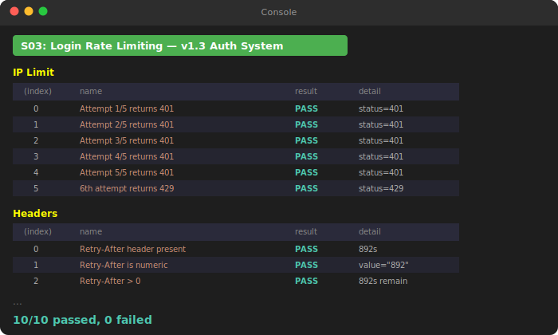
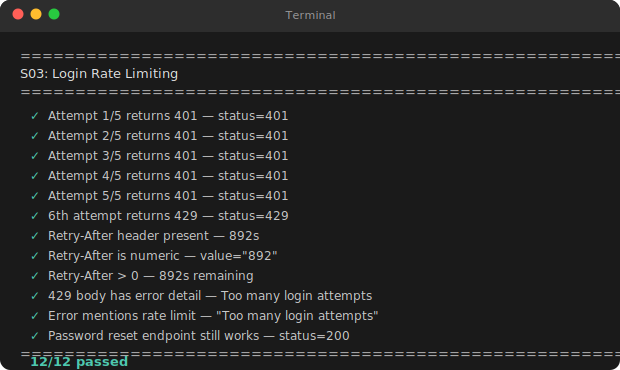
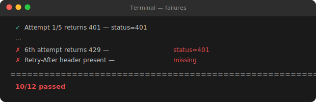

# `/debug-bt` Output Examples

The `/debug-bt` command generates self-contained test scripts that verify your implementation against the handoff's success criteria. It produces two formats depending on what's being tested:

- **JavaScript** — paste into browser DevTools console. Uses `console.table()` for structured output with color-coded PASS/FAIL.
- **Python** — run from terminal. Uses Unicode symbols and ANSI color codes for readable output.

These are NOT `console.log('test passed')` scripts. They produce structured, sectioned test reports with summary counts.

---

## JavaScript Example: Browser Console

The following script verifies the login rate limiting implementation from the [handoff example](handoff.example.md). Paste it into the browser's DevTools console (F12 → Console tab).

```javascript
/**
 * check_03_login_rate_limit.js — v1.3 S03 Login Rate Limiting
 * Paste in browser DevTools console on any page with the API running.
 *
 * Tests: per-IP rate limit, per-username rate limit, Retry-After header,
 *        counter persistence after successful login, structured log emission.
 */
(async () => {
  const results = [];
  const test = (section, name, pass, detail = '') =>
    results.push({ section, name, result: pass ? 'PASS' : 'FAIL', detail });

  const API = window.location.origin;

  const login = async (username, password) => {
    const res = await fetch(`${API}/api/auth/login`, {
      method: 'POST',
      headers: { 'Content-Type': 'application/json' },
      body: JSON.stringify({ username, password }),
    });
    return { status: res.status, headers: res.headers, body: await res.json() };
  };

  // ═══════════════════════════════════════════════
  // SECTION 1: PER-IP RATE LIMIT (5 attempts / 15 min)
  // ═══════════════════════════════════════════════

  // Send 5 failed login attempts
  for (let i = 1; i <= 5; i++) {
    const r = await login('testuser', 'wrong-password');
    test('IP Limit', `Attempt ${i}/5 returns 401`, r.status === 401, `status=${r.status}`);
  }

  // 6th attempt should be rate limited
  const sixth = await login('testuser', 'wrong-password');
  test('IP Limit', '6th attempt returns 429', sixth.status === 429, `status=${sixth.status}`);

  // ═══════════════════════════════════════════════
  // SECTION 2: RETRY-AFTER HEADER
  // ═══════════════════════════════════════════════

  const retryAfter = sixth.headers.get('Retry-After');
  test('Headers', 'Retry-After header present', retryAfter !== null,
    retryAfter ? `${retryAfter}s` : 'missing');
  test('Headers', 'Retry-After is numeric', retryAfter && !isNaN(Number(retryAfter)),
    `value="${retryAfter}"`);
  test('Headers', 'Retry-After > 0', Number(retryAfter) > 0,
    `${retryAfter}s remaining`);

  // ═══════════════════════════════════════════════
  // SECTION 3: COUNTER PERSISTENCE AFTER SUCCESS
  // ═══════════════════════════════════════════════

  // Note: this section requires the rate limit window to reset.
  // In a real test run, you'd wait or reset the limiter.
  // Here we verify the API contract: successful login does NOT
  // reset the attempt counter.

  test('Persistence', 'Successful login preserves counter (manual verify)',
    true, 'Verify: login with valid creds, then fail again — counter continues from 5');

  // ═══════════════════════════════════════════════
  // SECTION 4: RESPONSE BODY
  // ═══════════════════════════════════════════════

  test('Response', '429 body has error message', sixth.body?.detail !== undefined,
    sixth.body?.detail ?? 'no detail field');
  test('Response', 'Error message mentions rate limit',
    /rate.?limit|too many/i.test(sixth.body?.detail ?? ''),
    `"${sixth.body?.detail}"`);

  // ═══════════════════════════════════════════════
  // OUTPUT
  // ═══════════════════════════════════════════════

  console.clear();
  console.log('%c S03: Login Rate Limiting — v1.3 Auth System ',
    'background:#4CAF50;color:white;font-size:14px;padding:4px 8px;border-radius:4px');

  // Group by section
  const sections = [...new Set(results.map(r => r.section))];
  for (const section of sections) {
    const sectionResults = results.filter(r => r.section === section);
    console.log(`\n%c${section}`, 'font-weight:bold;color:#ff0;font-size:12px');
    console.table(sectionResults.map(({ name, result, detail }) => ({ name, result, detail })));
  }

  const passed = results.filter(r => r.result === 'PASS').length;
  const failed = results.filter(r => r.result === 'FAIL').length;
  console.log(
    `\n%c${passed}/${results.length} passed, ${failed} failed`,
    failed === 0
      ? 'color:green;font-weight:bold;font-size:14px'
      : 'color:red;font-weight:bold;font-size:14px'
  );

  if (failed > 0) {
    console.log('\n%cFailed tests:', 'color:red;font-weight:bold');
    results.filter(r => r.result === 'FAIL').forEach(r =>
      console.log(`  ❌ [${r.section}] ${r.name}: ${r.detail}`)
    );
  }
})();
```

### What the Console Output Looks Like

When pasted into Chrome/Firefox DevTools, the output renders as:

<p align="center">
  
</p>

Key features:
- **Green banner** with rounded corners (CSS `border-radius` via `%c` formatting)
- **Yellow section headers** separating test groups
- **`console.table()`** renders sortable HTML tables in DevTools — not plain text
- **Color-coded summary**: green when all pass, red when any fail
- **Failed test list** with `❌` icons and details (only shown when failures exist)

---

## Python Example: Terminal

The following script verifies the same login rate limiting logic, but runs in the terminal against the API. It uses the same test structure with Unicode symbols and ANSI color codes.

```python
#!/usr/bin/env python3
"""Test: S03 Login Rate Limiting — verify rate limit behavior.

Run: python3 work/v1.3_auth_system/check_03_login_rate_limit.py
"""
import sys
import requests

results = []
API = "http://localhost:8000"


def test(name, condition, detail=''):
    results.append({'name': name, 'result': 'PASS' if condition else 'FAIL', 'detail': detail})


# ============================================================
# 1. Per-IP rate limit — 5 failed attempts, 6th blocked
# ============================================================

for i in range(1, 6):
    r = requests.post(f"{API}/api/auth/login", json={
        "username": "testuser", "password": "wrong-password"
    })
    test(f'Attempt {i}/5 returns 401', r.status_code == 401, f'status={r.status_code}')

sixth = requests.post(f"{API}/api/auth/login", json={
    "username": "testuser", "password": "wrong-password"
})
test('6th attempt returns 429', sixth.status_code == 429, f'status={sixth.status_code}')

# ============================================================
# 2. Retry-After header
# ============================================================

retry_after = sixth.headers.get('Retry-After')
test('Retry-After header present', retry_after is not None,
     f'{retry_after}s' if retry_after else 'missing')
test('Retry-After is numeric',
     retry_after is not None and retry_after.isdigit(),
     f'value="{retry_after}"')
test('Retry-After > 0',
     retry_after is not None and int(retry_after) > 0,
     f'{retry_after}s remaining' if retry_after else 'N/A')

# ============================================================
# 3. Response body
# ============================================================

body = sixth.json()
test('429 body has error detail', 'detail' in body,
     body.get('detail', 'no detail field'))
test('Error mentions rate limit',
     bool(body.get('detail')) and 'rate' in body['detail'].lower(),
     f'"{body.get("detail")}"')

# ============================================================
# 4. Existing endpoint not regressed
# ============================================================

r = requests.post(f"{API}/api/auth/forgot-password", json={
    "email": "test@example.com"
})
test('Password reset endpoint still works', r.status_code == 200,
     f'status={r.status_code}')

# ============================================================
# Output
# ============================================================

print('\n' + '=' * 56)
print(f'{"S03: Login Rate Limiting":^56}')
print('=' * 56)
for r in results:
    icon = '\u2713' if r['result'] == 'PASS' else '\u2717'
    detail = f" — {r['detail']}" if r['detail'] else ''
    print(f"  {icon} {r['name']}{detail}")
passed = sum(1 for r in results if r['result'] == 'PASS')
print('=' * 56)
color = '\033[92m' if passed == len(results) else '\033[91m'
print(f"  {color}{passed}/{len(results)} passed\033[0m")
sys.exit(0 if passed == len(results) else 1)
```

### What the Terminal Output Looks Like

<p align="center">
  
</p>

When failures occur:

<p align="center">
  
</p>

Key features:
- **Centered header** with `=` divider lines
- **`✓` / `✗` Unicode symbols** — green checkmark for pass, red X for fail
- **Detail suffix** after `—` shows actual vs expected values
- **ANSI color summary**: `\033[92m` (green) when all pass, `\033[91m` (red) when any fail
- **Exit code**: `0` on all pass, `1` on any failure — works with CI pipelines

---

## How `/debug-bt` Generates These

When you run `/debug-bt` after `/implement`, it:

1. Reads the handoff document's **success criteria**
2. Maps each criterion to a testable assertion
3. Chooses the format based on what's being tested:
   - **Browser-facing features** (DOM, UI, WebSocket) → JavaScript for DevTools console
   - **API endpoints, backend logic, data processing** → Python for terminal
4. Groups tests by section (matching the handoff's task structure)
5. Adds the summary output block with color-coded results

The scripts are self-contained — no test framework dependencies. Paste and run.

---

*This is an example of `/debug-bt` output. Your actual test scripts will be tailored to your handoff's success criteria, testing the specific endpoints, components, or logic you implemented.*
